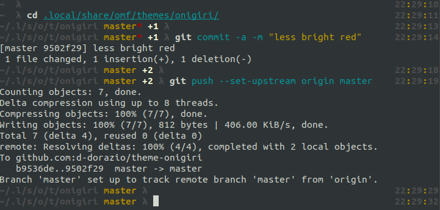

#### onigiri
> A theme for [Oh My Fish][omf-link]. Heavily inspired by [theme-sushi](https://github.com/umayr/theme-sushi)

[](/LICENSE)
[](https://fishshell.com)
[](https://www.github.com/oh-my-fish/oh-my-fish)

<br/>


## Install

```fish
$ omf install https://github.com/d-dorazio/theme-onigiri
$ omf theme onigiri
```


## Screenshot




# License

[MIT][mit] © [d-dorazio][author] et [al][contributors]


[mit]:            https://opensource.org/licenses/MIT
[author]:         https://github.com/d-dorazio
[contributors]:   https://github.com/d-dorazio/theme-onigiri/graphs/contributors
[omf-link]:       https://www.github.com/oh-my-fish/oh-my-fish

[license-badge]:  https://img.shields.io/badge/license-MIT-007EC7.svg?style=flat-square
